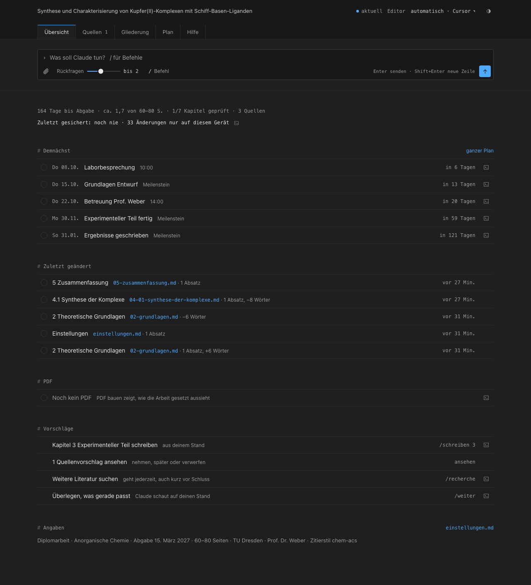
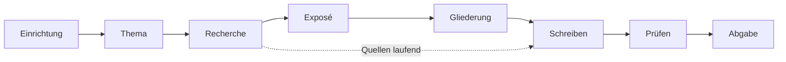

# Scientific Writing Kit

Deine wissenschaftliche Arbeit mit Claude, von der Themenfindung bis zum fertigen PDF.
Für Menschen ohne Technik-Erfahrung: Du klickst Antworten an, Claude recherchiert, fragt
nach, widerspricht, schreibt und prüft. Ein Dashboard zeigt dir jederzeit, wo du stehst.

> **English:** A Claude Code template for writing a thesis end to end: topic, literature
> research, proposal, outline, writing, review, LaTeX PDF. Non-technical users, Windows and
> macOS, VS Code. The interface is German, the thesis itself can be German or English.



## Start hier

Du hast das Projekt schon offen? Dann rechts in VS Code das Claude-Symbol anklicken und

```
/start
```

tippen. Claude stellt dir etwa zehn Minuten lang Fragen zum Anklicken und richtet alles ein.
Danach genügt jeden Tag ein „mach weiter“.

## Was du links siehst

| Ordner oder Datei | Was darin liegt |
| --- | --- |
| `kapitel/` | deine Kapitel, ein Unterkapitel je Datei |
| `quellen/` | Literaturverzeichnis, PDFs, Notizen mit Zitaten, `eingang/` für neue Dateien |
| `daten/` | Messdaten und Auswertungen |
| `abbildungen/` | Grafiken, Diagramme, Logo |
| `Arbeit.pdf` | deine Arbeit als PDF, entsteht mit `/pdf` |
| `README.md` | diese Anleitung |

Alles Technische ist ausgeblendet. Deine Einstellungen und dein Stand liegen im versteckten
Ordner `.arbeit/`. Du öffnest sie über das Dashboard oder sagst Claude, was sich ändern soll.
Gesichert wird alles mit `/sync`.

## Die elf Befehle

Du musst sie nicht auswendig kennen. Sag Claude einfach, was du willst. Die meisten startet
Claude dann selbst.

| Befehl | In Klartext |
| --- | --- |
| `/start` | Richtet dein Projekt ein, später änderst du damit Einstellungen |
| `/weiter` | Der nächste sinnvolle Schritt, mit Freigabe am Ende. Auch: „mach weiter“ |
| `/recherche` | Sucht Literatur und legt Vorschläge ins Dashboard, du entscheidest |
| `/quellen` | Nimmt gewählte Quellen auf: Literaturverzeichnis, PDF, Zitate mit Seite |
| `/schreiben 2.1` | Plant und schreibt ein Unterkapitel oder verbessert deinen Text |
| `/pruefen 2.1` | Prüft wie eine Gutachterin, mit Notenschätzung |
| `/pdf` | Baut das PDF, einen Entwurf, das Exposé oder eine Word-Datei |
| `/sync` | Sichert alles auf GitHub. Am Ende jedes Arbeitstags |
| `/update` | Holt eine neue Version des Kits, deine Arbeit bleibt unberührt |
| `/hilfe` | Erklärt und repariert, wenn etwas hakt |
| `/dashboard` | Öffnet das Dashboard oder baut es nach deinem Wunsch um |

Mehr dazu: [Alle Befehle](.claude/kit/docs/befehle.md) ·
[Die ersten 30 Minuten](.claude/kit/docs/erste-schritte.md) ·
[Das Dashboard](.claude/kit/docs/dashboard.md) · [Probleme](.claude/kit/docs/probleme.md)

## Der Weg



## Was das Kit anders macht

- **Interview statt Formular.** Jede Rückfrage kommt als Auswahl mit Knöpfen und freiem Feld.
- **Challenge.** Freundlich im Ton, hart in der Sache: Schwachstellen zuerst.
- **Recherche mit Auswahl.** Claude prüft jede Quelle über ihre DOI, du entscheidest im Dashboard.
- **Zitattreue.** Zu jedem Zitat liegen Originalwortlaut und gedruckte Seite. Die Prüfung
  vergleicht mit dem Original, nicht mit einer Übersetzung.
- **Umfang in Seiten.** Du gibst einen Seitenbereich vor, jedes Kapitel bekommt seinen Anteil.
- **Deine Regeln.** Ich-Form, Gedankenstriche, Satzlänge und mehr sind Schalter in deinen
  Einstellungen, passend zu den Vorgaben deiner Betreuung.
- **Naturwissenschaft ernst genommen.** Formeln, Einheiten, chemische Formeln, Abbildungen
  aus eigenen Daten, Python für Auswertungen.
- **Echtes LaTeX.** Du schreibst nie LaTeX, du siehst nur das PDF.
- **Transparenz.** KI-Nutzung wird automatisch protokolliert und landet im
  Hilfsmittelverzeichnis.

## Installation

**1. Konten anlegen:** ein Claude-Abo auf [claude.ai](https://claude.ai) (Claude Code ist ab Pro
dabei) und ein kostenloses Konto auf [github.com/signup](https://github.com/signup).

**2. Einrichtungs-Skript starten.** Es installiert VS Code, Git, LaTeX, Pandoc, Python (uv) und
Claude Code, legt dein privates Projekt auf GitHub an und öffnet es.

Windows (PowerShell):
```powershell
irm https://raw.githubusercontent.com/koljaschoepe/scientific-writing/main/.claude/kit/install/install-windows.ps1 | iex
```
macOS (Terminal):
```bash
curl -fsSL https://raw.githubusercontent.com/koljaschoepe/scientific-writing/main/.claude/kit/install/install-mac.sh | bash
```

**3. In VS Code rechts das Claude-Symbol öffnen und `/start` tippen.**

Lieber Cursor? Geht genauso: in Cursor die Erweiterung „Claude Code“ installieren („Install for
Cursor“, Open VSX `anthropic.claude-code`), Projektordner öffnen, `/start`. Links aus Dashboard
und Chat öffnen dann in Cursor.

Schritt für Schritt mit allen Dialogen: [Windows](.claude/kit/docs/installation-windows.md) ·
[macOS](.claude/kit/docs/installation-mac.md)

Schon eingerichtet und nur das Template nutzen? Oben „Use this template“, privates Repo
anlegen, in VS Code öffnen, `/start`.

## Herkunft und Lizenz

Das Kit ist aus der Bachelorarbeit „Spec-Driven-Writing: Ein Framework für die systematische
KI-gestützte Erstellung von Marketing-Inhalten“ (HTW Dresden, 2026) entstanden. Die Qualität
kam dort nicht aus der ersten Fassung, sondern aus den Prüfrunden danach. Genau diese Runden
sind fester Teil von `/pruefen`.

Fehler und Ideen als [Issue](https://github.com/koljaschoepe/scientific-writing/issues).
Lizenz: MIT (`.claude/kit/LICENSE`, im Template `LICENSE`).
