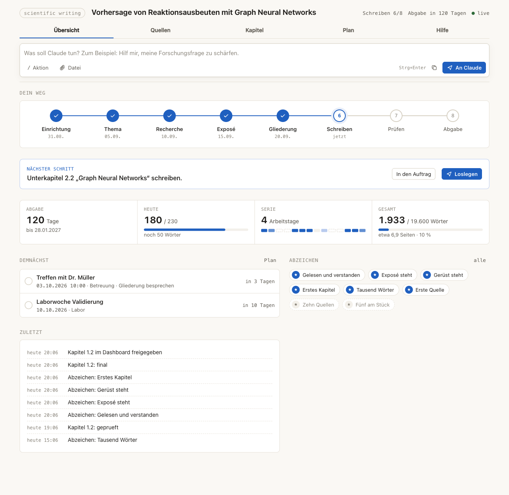
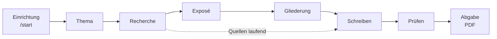

# Scientific Writing Kit

[](LICENSE)
[](https://claude.com/claude-code)


Deine wissenschaftliche Arbeit mit Claude, von der Themenfindung bis zum fertigen PDF.
Für Menschen ohne Technik-Erfahrung: Du klickst Antworten an, Claude recherchiert, fragt
nach, widerspricht, schreibt und prüft. Ein Dashboard zeigt dir jederzeit, wo du stehst.

> **English:** A Claude Code template for writing a thesis end to end: topic, literature
> research, proposal, outline, writing, review, LaTeX PDF. Non-technical users, Windows and
> macOS, VS Code. The interface is German, the thesis itself can be written in German or
> English. Start with the install script below, then type `/start`.



## In drei Schritten starten

**1. Claude-Abo und GitHub-Konto anlegen** ([claude.ai](https://claude.ai), Claude Code ist ab
Pro dabei; [github.com/signup](https://github.com/signup), kostenlos).

**2. Einrichtungs-Skript starten.** Installiert VS Code, Git, LaTeX, Pandoc, Python (uv) und
Claude Code, legt dein privates Projekt auf GitHub an und öffnet es.

Windows (PowerShell):
```powershell
irm https://raw.githubusercontent.com/koljaschoepe/scientific-writing/main/install/install-windows.ps1 | iex
```
macOS (Terminal):
```bash
curl -fsSL https://raw.githubusercontent.com/koljaschoepe/scientific-writing/main/install/install-mac.sh | bash
```

**3. In VS Code rechts das Claude-Symbol öffnen und `/start` tippen.**

Schritt für Schritt mit allen Dialogen: [Windows](docs/installation-windows.md) ·
[macOS](docs/installation-mac.md) · [Die ersten 30 Minuten](docs/erste-schritte.md)

Schon eingerichtet und nur das Template nutzen? Oben „Use this template“, privates Repo
anlegen, in VS Code öffnen, `/start`.

## Der Weg



`/weiter` macht in jeder Phase den nächsten sinnvollen Schritt und fragt am Ende, ob du das
Ergebnis freigibst. Das Exposé ist ein eigener Meilenstein, als PDF für deinen Betreuer.

## Was das Kit anders macht

- **Interview statt Formular.** Jede Rückfrage kommt als Auswahl mit Knöpfen und freiem Feld.
  Claude fragt so lange nach, bis klar ist, was du willst, und passt sich deiner Arbeitsweise an.
- **Challenge.** Freundlich im Ton, hart in der Sache: Schwachstellen zuerst, Gegenargument zu
  jeder Entscheidung, Notenschätzung pro Kapitel.
- **Recherche mit Triage.** Claude sucht in Fachdatenbanken, über deinen Uni-Zugang und im
  Web, prüft jede Quelle über ihre DOI und legt Vorschläge mit Begründung ins Dashboard. Du
  entscheidest.
- **Zitattreue.** Zu jedem Zitat liegen Originalwortlaut und Seite. Die Prüfung vergleicht
  mit dem Original, nicht mit einer Übersetzung.
- **Naturwissenschaft ernst genommen.** Fachprofile für Naturwissenschaft, Technik,
  Wirtschaft und Geisteswissenschaft. Experimenteller Teil, Formeln, Einheiten (siunitx),
  chemische Formeln (mhchem, chemfig), Abbildungen aus eigenen Daten, Code-Teil mit Python.
- **Echtes LaTeX.** KOMA-Script-Vorlage, BibLaTeX mit ACS, RSC, Angewandte, IEEE, APA oder
  Harvard. Du schreibst nie LaTeX, du siehst nur das PDF.
- **Dashboard.** Fahrplan, Fristen, Tagesziel, Kapitelstand, Quellen-Board, Auftragsfeld,
  das Claude mit einem Klick startet.
- **Transparenz.** KI-Nutzung wird automatisch protokolliert und landet im
  Hilfsmittelverzeichnis.
- **Backup mit /sync.** Privates GitHub-Repo, ein Befehl, Konflikte werden im Gespräch gelöst.

## Befehle

| Befehl | Wofür |
| --- | --- |
| `/start` | Projekt per Interview einrichten |
| `/weiter` | nächster sinnvoller Schritt, mit Freigabe am Ende |
| `/recherche [thema]` | Literatur suchen, Vorschläge ins Dashboard |
| `/quellen` | genommene Quellen und Uploads auswerten |
| `/schreiben [nr]` | Unterkapitel planen und schreiben oder überarbeiten |
| `/pruefen [nr\|alles]` | Sprache, Zitattreue, Argumentation, Fachliches, Umfang |
| `/pdf [entwurf]` | PDF bauen |
| `/sync` | sichern und mit GitHub abgleichen |
| `/update` | neue Kit-Version holen, Arbeit bleibt unberührt |
| `/hilfe [frage]` | Lage, Systemcheck, Reparatur |
| `/dashboard [anpassen …]` | Dashboard öffnen oder umbauen |

Details: [docs/befehle.md](docs/befehle.md)

## Aufbau

| Ordner | Gehört | Inhalt |
| --- | --- | --- |
| `arbeit/` | dir | Einstellungen, Zustand, Plan, Thema, Exposé, Gliederung, Kapitel, Prüfberichte |
| `quellen/` | dir | Literatur (`literatur.bib`), Vorschläge, Zitate, PDFs, Eingang für Uploads |
| `code/`, `daten/`, `abbildungen/` | dir | Auswertungen, Messdaten, Grafiken |
| `kit/`, `.claude/`, `latex/vorlage/`, `docs/` | Kit | Werkzeuge, Befehle, Leitfäden, Vorlagen. Kommen per `/update` |

## Herkunft

Das Kit ist aus der Bachelorarbeit „Spec-Driven-Writing: Ein Framework für die systematische
KI-gestützte Erstellung von Marketing-Inhalten“ (HTW Dresden, 2026) entstanden. Version 2
übernimmt die Lehren daraus: Die Qualität kam nicht aus der ersten Pipeline, sondern aus den
Prüfrunden danach (Zitattreue gegen das Original, harte Sprachschwellen, Kürzungsplan,
Hilfsmittelverzeichnis). Genau diese Runden sind jetzt fester Teil von `/pruefen`.

## Mitmachen und Lizenz

Fehler und Ideen als [Issue](https://github.com/koljaschoepe/scientific-writing/issues),
Beiträge siehe [CONTRIBUTING.md](CONTRIBUTING.md). Lizenz: [MIT](LICENSE).
